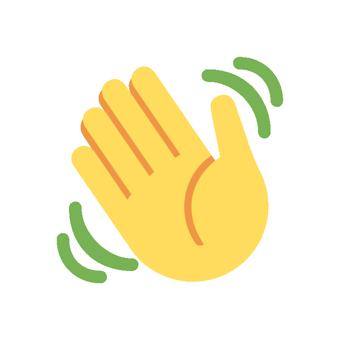
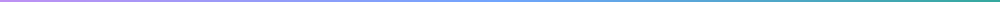

# README.md

  <h1>
    <strong>Hey</strong>
    
    <strong>I'm Paul Oluyomi Ajide</strong>
  </h1>

  

    🚀 Frontend Developer | 💡 Lifelong Learner | 🎨 Building Modern Web Experiences
  

  

    <em>
      Passionate about creating responsive, user-friendly, and visually appealing web applications with modern technologies.
    </em>
  

  

<h2>🙋 About Me</h2>

<h3>🌟 Who I Am</h3>

Frontend Developer passionate about creating responsive, accessible, and engaging user interfaces.
I enjoy transforming ideas into interactive digital experiences using modern web technologies and
continuously improving my skills through hands-on projects and real-world problem solving.

<h3>📚 Currently Learning</h3>

<ul>
  <li><strong>React.js</strong> and modern component architecture</li>
  <li><strong>State Management</strong> techniques</li>
  <li><strong>API Integration</strong> and asynchronous JavaScript</li>
  <li><strong>Frontend Performance</strong> optimization</li>
  <li><strong>Advanced Tailwind CSS</strong> workflows</li>
</ul>

<h3>🚀 What Drives Me</h3>

<ul>
  <li>Building clean and intuitive user interfaces</li>
  <li>Creating solutions that improve user experience</li>
  <li>Learning and mastering modern web technologies</li>
  <li>Collaborating on impactful projects</li>
  <li>Turning creative ideas into functional products</li>
</ul>

<h3>🎯 Vision</h3>

My goal is to become a highly skilled Frontend Engineer capable of building scalable,
high-performance web applications that deliver exceptional user experiences.
I aim to contribute to innovative projects, collaborate with talented developers,
and continue growing within the ever-evolving tech industry.

 

  

  

  

  

  

<h2>🛠️ Tech Stack</h2>

<h3>🎨 Languages & Core</h3>

  
  
  

<h3>⚛️ Frontend Development</h3>

  
  

<h3>🧰 Tools</h3>

  
  
  

  

<h2>📊 GitHub Stats</h2>

 

<h2>📈 GitHub Activity Graph</h2>

<h2>🏆 GitHub Trophies</h2>

  

<h2>🧠 Quotes To Live By</h2>

> "Success is built one line of code at a time."

 

> "Keep learning. Keep building. Keep improving."

  

<h2 align="left">🔗 Let's Connect</h2>

 

  

 

<h3 align="center">💡 Current Focus</h3>

Building modern frontend applications with HTML, CSS, Tailwind CSS, JavaScript, and React.

 

<h6 align="center">
💜 Built with passion by <strong>Paul Oluyomi Ajide</strong> 
Frontend Developer • Lifelong Learner • Open to Collaborations
</h6>

